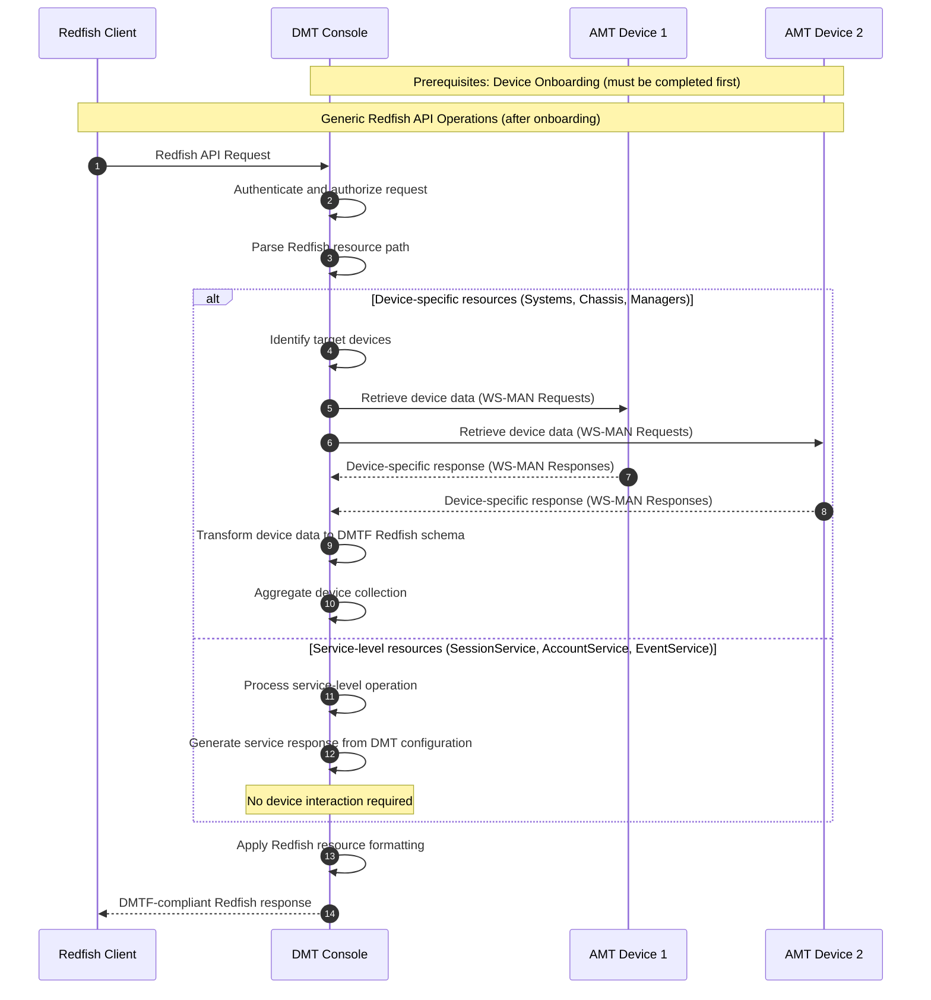
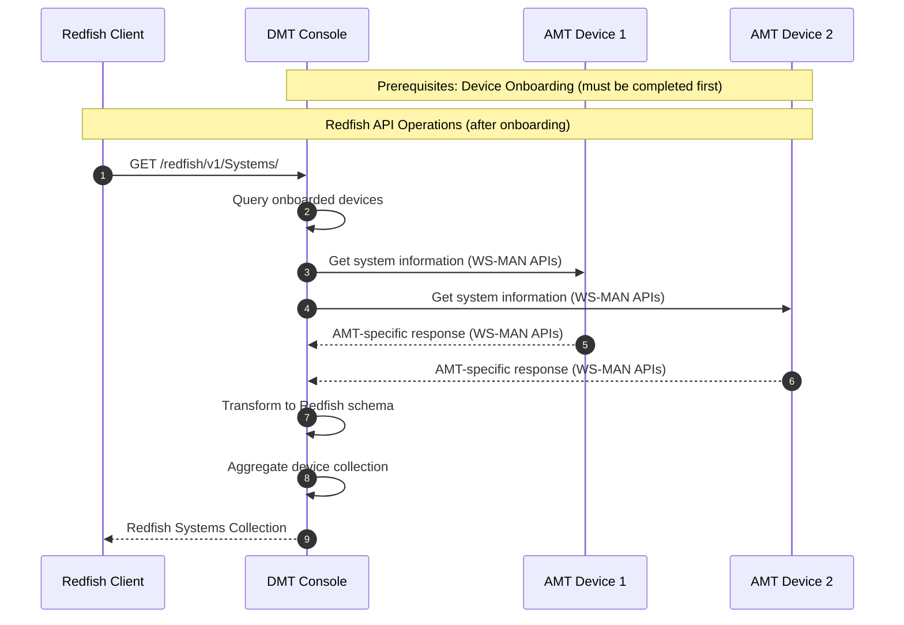
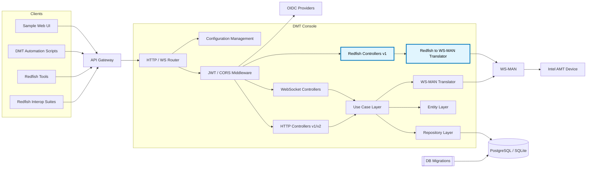
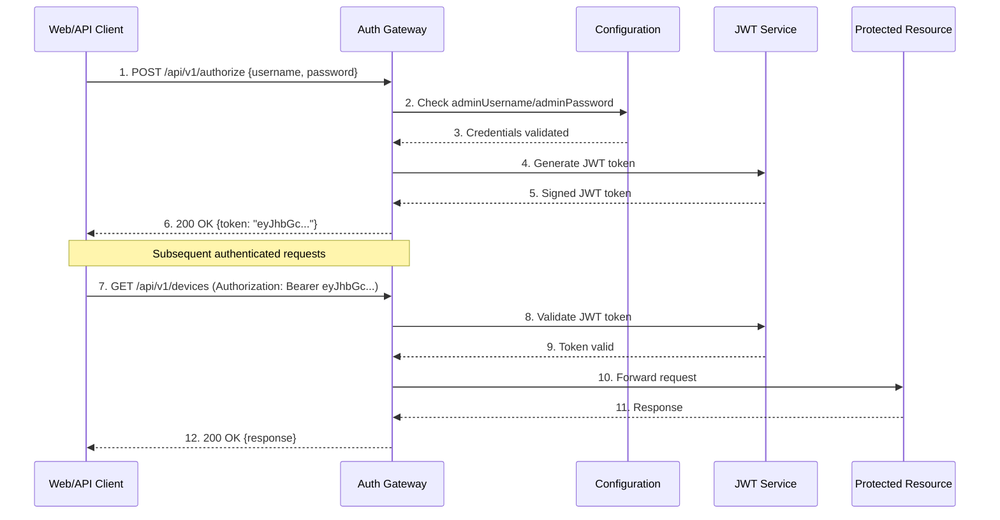
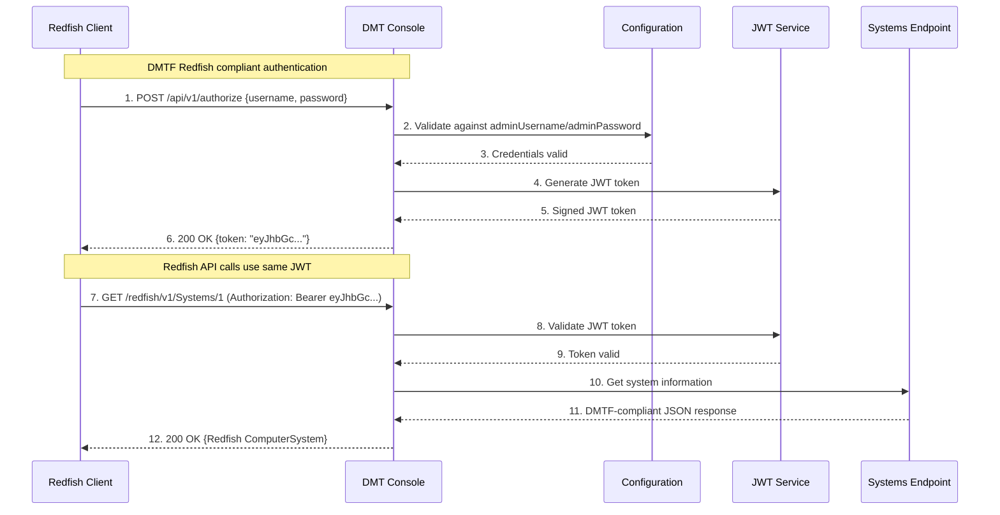
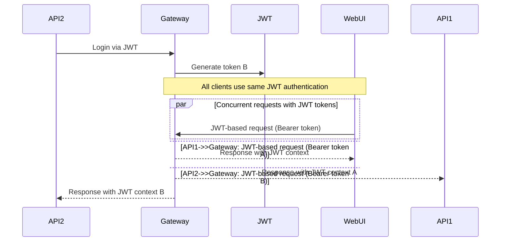
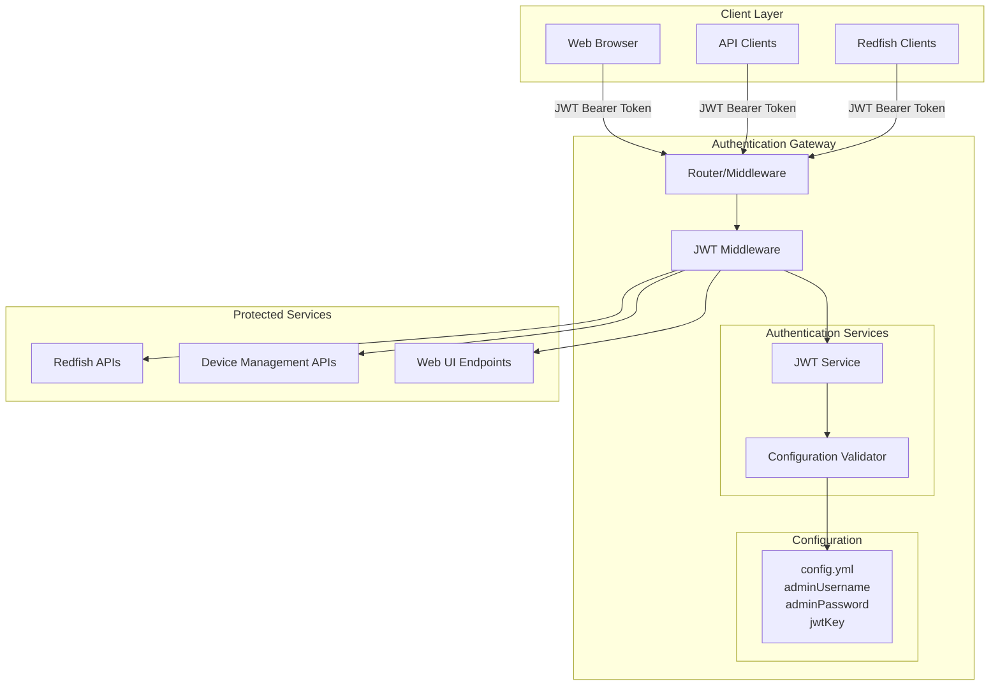
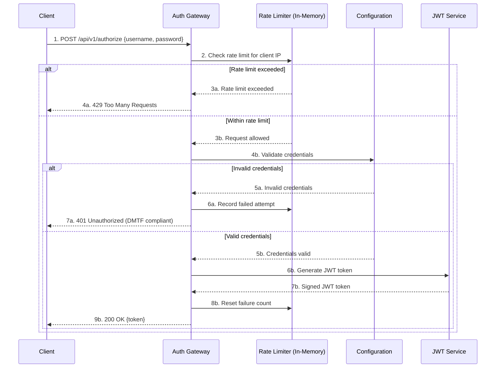

# Redfish Support

## Table of Contents

- [Introduction](#introduction)
- [Redfish usage from DMT](#redfish-usage-from-dmt)
- [Architecture and Design](#architecture-and-design)
- [Redfish Resource Mapping](#redfish-resource-mapping)
- [Redfish Authentication Architecture](#redfish-authentication-architecture)

## Introduction

**[Redfish](https://www.dmtf.org/standards/redfish)** is a modern, REST-based API standard developed by the **Distributed Management Task Force (DMTF)** for managing servers, storage systems, networking equipment, and other computing infrastructure. It provides a secure, scalable approach to systems management that replaces older protocols like IPMI (Intelligent Platform Management Interface) and traditional proprietary management interfaces. Key Characteristics of Redfish

1. RESTful Architecture - Uses standard HTTP/HTTPS methods (GET, POST, PATCH, DELETE)
1. Standardized Data Models - Common schema for representing hardware components with consistent naming conventions across vendors and well-defined resource relationships.
1. Security-First Design - Built-in authentication and authorization mechanisms, HTTPS/TLS encryption for all communications, Role-based access control (RBAC) and Event-driven security notifications

### Redfish API Structure

Redfish organizes system resources in a hierarchical tree structure:

```text
/redfish/v1/                             # Service Root
├── Systems/                             # Computer Systems
│   ├── 1/                               # Specific System
│   │   ├── Processors/                  # CPU Information
│   │   ├── Memory/                      # Memory Modules
│   │   ├── Storage/                     # Storage Controllers
│   │   ├── NetworkInterfaces/           # Network Adapters
│   │   └── Actions/                     # Available Actions
├── Chassis/                             # Physical Chassis
├── Managers/                            # Management Controllers
├── AccountService/                      # User Account Management
├── SessionService/                      # Session Management
├── EventService/                        # Event Subscriptions
└── UpdateService/                       # Firmware Updates
```

### Redfish in the DMT Context

The **DMT** leverages Redfish to provide unified management capabilities for Intel Active Management Technology (AMT) enabled devices. This integration offers several advantages:

1. Standardized Device Management -  Common API interface for all managed devices and simplified client integration for third-party tools
1. Enterprise Integration - Integration with existing enterprise management tools, Support for bulk operations across multiple devices, Standardized reporting and monitoring capabilities
1. Future-Proof Architecture - Built on industry standards that continue to evolve, Support for emerging hardware features through schema extensions, Compatibility with next-generation management tools.

## Redfish usage from DMT

The DMT Console exposes **Redfish APIs as additional endpoints** alongside the existing DMT REST APIs, effectively acting as a **Redfish Aggregator** for all Intel Active Management Technology (AMT) enabled devices under its management. This architecture provides a standardized Redfish interface while maintaining backward compatibility with existing DMT workflows.

### Device Onboarding Prerequisite

> **Important**: Before a device can be accessed via Redfish APIs, it **must be onboarded** to the DMT Console using existing DMT procedures as described in the [DMT Enterprise Device Activation, Addition](https://device-management-toolkit.github.io/docs/2.28/GetStarted/Enterprise/activateDevice/).

Once onboarded through DMT, the device becomes available via both:

- **DMT REST APIs** - Immediate availability for existing workflows
- **Redfish APIs** - Standards-compliant access through `/redfish/v1/` endpoints

Both API sets operate on the same underlying device infrastructure, with DMT serving as an intelligent **Redfish Aggregator** that:

- **Translates** between AMT device capabilities and Redfish data models
- **Aggregates** multiple AMT devices into a unified Redfish service root
- **Normalizes** device responses to conform to DMTF Redfish schemas
- **Proxies** Redfish requests to appropriate AMT devices
- **Maintains** consistent authentication and authorization across both API sets

### Redfish Workflow Sequence

The following sequence diagram illustrates the generic workflow for any Redfish API request through the DMT Console aggregator:



#### Device Mapping Example

When a device is onboarded to DMT, it becomes accessible via both API paradigms:

**DMT REST API Access:**

```bash
# Get device information via DMT API
GET /api/v1/devices/{device-uuid}
Authorization: Bearer {jwt-token}
```

**Redfish API Access:**

```bash
# Get same device via Redfish API
GET /redfish/v1/Systems/{device-uuid}
Authorization: Bearer {jwt-token} [TBD on how to support Authorization header]
```

Both endpoints provide access to the same AMT device, but with different data representations:

- **DMT API** returns DMT-specific JSON structure
- **Redfish API** returns DMTF-compliant ComputerSystem schema

#### Redfish Aggregation Workflow Example

The following sequence diagram illustrates how the DMT Console aggregates multiple onboarded AMT devices into a unified Redfish Systems collection:



### **Prerequisites Summary**

Before utilizing Redfish APIs for any AMT device:

✅ **Required Steps:**

1. Device must be **discoverable** on the network
2. Device must have **AMT enabled** and properly configured
3. Device must be **onboarded** through DMT's existing procedures
4. Device must be **healthy** and responsive in DMT console
5. User must have **valid authentication** to DMT console

This approach ensures that **all existing DMT investments and procedures remain valuable** while providing the additional benefit of standards-compliant Redfish access to the same managed infrastructure.

## Architecture and Design

### High-Level Architecture Overview

In the following diagram, we present the high-level architecture of the DMT Console's Redfish implementation.



**Topics to be covered:**

- Component responsibilities and interfaces
- Integration points with existing DMT services
- Error handling and fault tolerance mechanisms

## Redfish Resource Mapping

The following table provides a comprehensive overview of each Redfish resource type implemented within the DMT Console. Each resource type links to documentation covering implementation specifics and capabilities.

| **Resource Type** | **Category** | **Description** |
|---|---|---|
| **[Systems](02-redfish-systems.md)** | Device-Specific | Represents computer systems with ComputerSystem schema mapping from AMT data, including processor, memory, storage, network, power, thermal, and boot management capabilities |
| **[Chassis](03-redfish-chassis.md)** | Device-Specific | Provides physical hardware inventory including chassis information, thermal sensors, power supplies, fan control, physical security, asset tracking, and environmental monitoring |
| **[Managers](04-redfish-managers.md)** | Device-Specific | Manages AMT controller capabilities including network services, certificate management, logging, virtual media, remote console access, and firmware update mechanisms |
| **[AccountService](05-redfish-accountservice.md)** | Service-Level | Handles user account management within DMT context, including RBAC implementation, password policies, security settings, and account lifecycle management |
| **[SessionService](06-redfish-sessionservice.md)** | Service-Level | Manages authentication sessions, JWT token handling, session timeouts, cleanup procedures, and concurrent session limitations |
| **[EventService](07-redfish-eventservice.md)** | Service-Level | Provides event handling capabilities including subscription management, filtering, routing, push notifications, and event history logging |
| **[UpdateService](08-redfish-updateservice.md)** | Service-Level | Coordinates firmware updates across devices with scheduling, orchestration, progress tracking, status reporting, and rollback mechanisms |

## Redfish Authentication Architecture

### Overview

The DMT Console implements a unified, simple authentication architecture using configuration-based credentials and JWT tokens for all client types, maintaining DMTF Redfish specification compliance.

### Unified Authentication Flow

```text
┌─────────────────┐    ┌─────────────────┐    ┌─────────────────┐
│   Web Browsers  │    │   API Clients   │    │ Redfish Clients │
└─────────────────┘    └─────────────────┘    └─────────────────┘
         │                       │                       │
         │                       │                       │
         └───────────────────────┼───────────────────────┘
                                 │ JWT Token (Authorization: Bearer)
                                 ▼
               ┌─────────────────────────────────────┐
               │         Authentication Layer        │
               │    ┌───────────────────────────┐    │
               │    │      JWT Validator        │    │
               │    │   (config.yml creds)      │    │
               │    └───────────────────────────┘    │
               └─────────────────────────────────────┘
                                 │
                                 ▼
               ┌─────────────────────────────────────┐
               │         Protected Resources         │
               │  • Web UI          • Redfish APIs   │
               │  • REST APIs       • Device Mgmt    │
               └─────────────────────────────────────┘
```

### Authentication Sequence Diagrams

#### 1. Current Login Flow (Configuration-Based Authentication)



**Current Implementation Notes:**

- No user database table exists
- Single admin user from configuration: `standalone/G@ppm0ym`
- Same JWT token used for both web UI and API access
- No session management - stateless JWT only

#### 2. Future Enhanced Authentication Flow (Design Goal)



**Key Benefits:**

- Same authentication endpoint for all clients
- DMTF Redfish specification compliance
- No separate authentication systems to maintain
- Universal JWT token works everywhere

#### 4. Unified Configuration Example

**config.yml:**

```yaml
auth:
  disabled: false
  adminUsername: admin
  adminPassword: your-secure-password
  jwtKey: your-256-bit-secret-key
  jwtExpiration: 24h0m0s
```

**Environment Variables (Production):**

```bash
AUTH_ADMIN_USERNAME=admin
AUTH_ADMIN_PASSWORD=your-secure-password
AUTH_JWT_KEY=your-256-bit-secret-key
AUTH_JWT_EXPIRATION=24h
```

### 5. Client Examples

**Web UI Login:**

```javascript
// Same endpoint for all clients
const response = await fetch('/api/v1/authorize', {
  method: 'POST',
  headers: { 'Content-Type': 'application/json' },
  body: JSON.stringify({
    username: 'admin',
    password: 'your-secure-password'
  })
});
const { token } = await response.json();

// Use token for all subsequent requests
localStorage.setItem('jwt_token', token);
```

**Redfish Client:**

```bash
# Get JWT token (same endpoint)
TOKEN=$(curl -s -X POST /api/v1/authorize \
  -H "Content-Type: application/json" \
  -d '{"username":"admin","password":"your-secure-password"}' \
  | jq -r '.token')

# Use token for Redfish API calls
curl -H "Authorization: Bearer $TOKEN" \
  /redfish/v1/Systems/1
```

**API Client:**

```python
import requests

# Authenticate once
auth_response = requests.post('/api/v1/authorize', json={
    'username': 'admin',
    'password': 'your-secure-password'
})
token = auth_response.json()['token']

# Use for all API calls
headers = {'Authorization': f'Bearer {token}'}
devices = requests.get('/api/v1/devices', headers=headers)

```



#### 7. Simplified Authentication Gateway Components



#### 8. Authentication with In-Memory Rate Limiting



### Security Considerations

#### Simple Yet Secure

The unified JWT approach maintains strong security with minimal complexity:

##### Token Security

- **Secret Management**: Store JWT signing key in environment variables
- **Secure Transmission**: Always use HTTPS/TLS in production
- **Token Expiration**: Configurable expiration times (default: 24 hours)
- **Secure Storage**: Web UI stores tokens in secure, HTTP-only cookies

##### Configuration Security

- **Password Hashing**: Admin password properly hashed with bcrypt
- **Environment Variables**: Sensitive config never committed to code
- **Key Rotation**: JWT signing key can be rotated
- **Minimal Attack Surface**: No user management endpoints to secure

##### Rate Limiting Security

- **Brute Force Protection**: In-memory tracking prevents password attacks
- **No External Dependencies**: No Redis or database needed for rate limiting
- **Automatic Cleanup**: Expired rate limit entries automatically removed
- **IP-Based Blocking**: Prevents attacks from specific source addresses
- **Configurable Thresholds**: Adjustable limits for different security needs
- **DMTF Compliant Responses**: Returns proper HTTP 429 with Redfish error format
