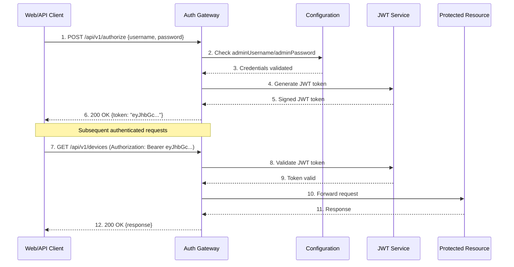
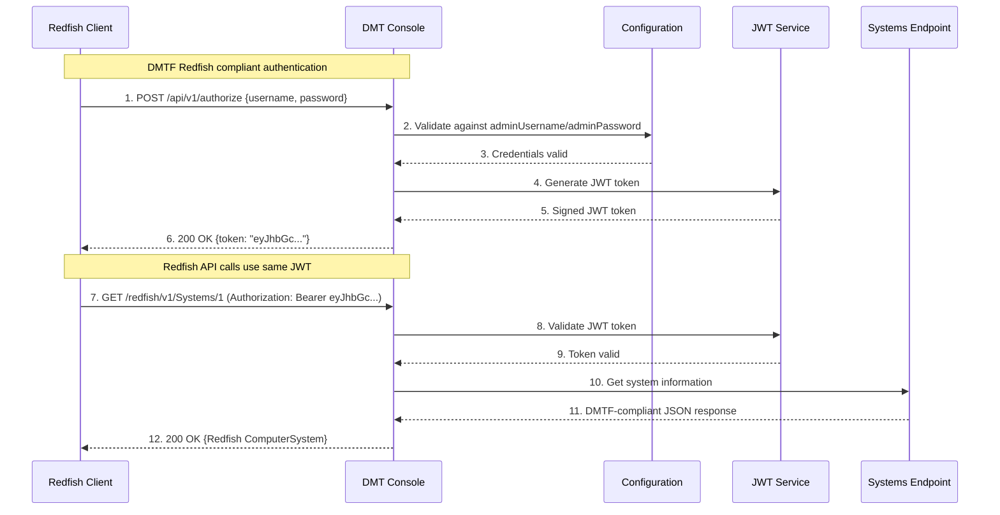
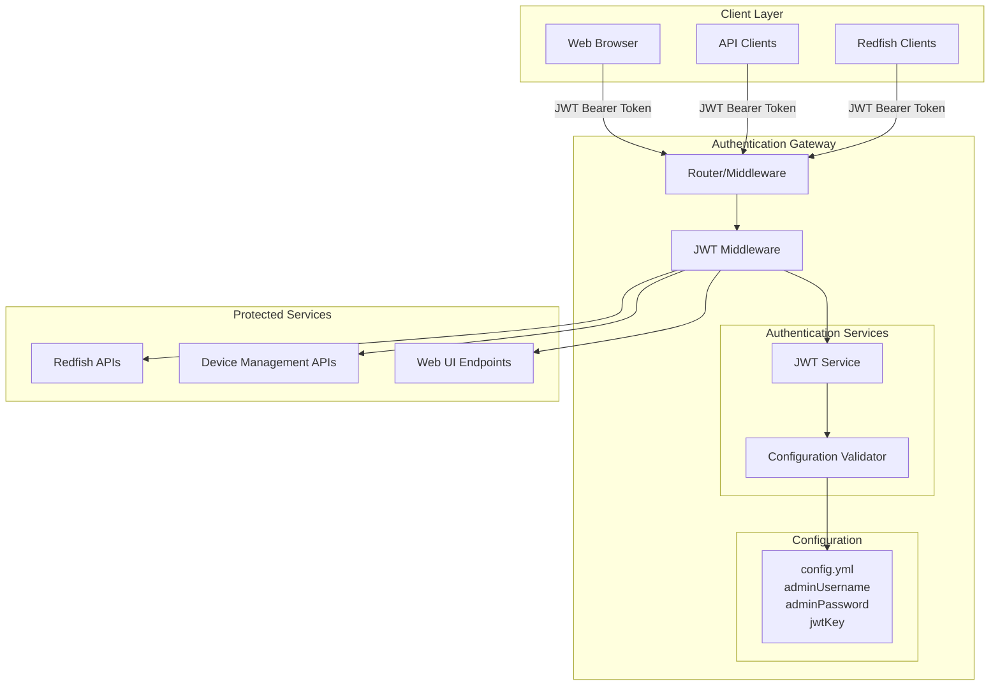
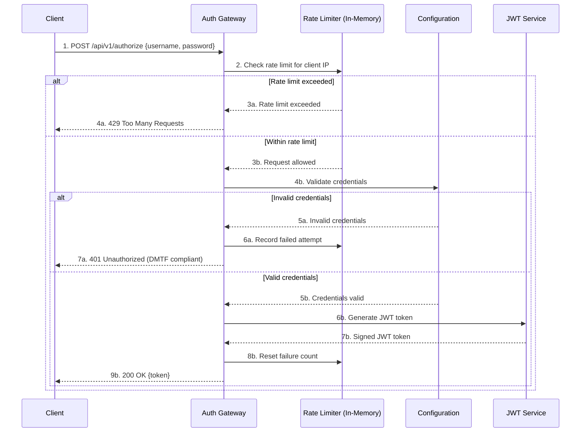

# Authentication Architecture

## Overview

The DMT Console implements a unified, simple authentication architecture using configuration-based credentials and JWT tokens for all client types, maintaining DMTF Redfish specification compliance.

## Unified Authentication Flow

```
┌─────────────────┐    ┌─────────────────┐    ┌─────────────────┐
│   Web Browsers  │    │   API Clients   │    │ Redfish Clients │
└─────────────────┘    └─────────────────┘    └─────────────────┘
         │                       │                       │
         │                       │                       │
         └───────────────────────┼───────────────────────┘
                                 │ JWT Token (Authorization: Bearer)
                                 ▼
               ┌─────────────────────────────────────┐
               │         Authentication Layer        │
               │    ┌───────────────────────────┐    │
               │    │      JWT Validator        │    │
               │    │   (config.yml creds)     │    │
               │    └───────────────────────────┘    │
               └─────────────────────────────────────┘
                                 │
                                 ▼
               ┌─────────────────────────────────────┐
               │         Protected Resources         │
               │  • Web UI          • Redfish APIs  │
               │  • REST APIs       • Device Mgmt   │
               └─────────────────────────────────────┘
```

## Authentication Sequence Diagrams

### 1. Current Login Flow (Configuration-Based Authentication)



**Current Implementation Notes:**

- No user database table exists
- Single admin user from configuration: `standalone/G@ppm0ym`
- Same JWT token used for both web UI and API access
- No session management - stateless JWT only

### 2. Future Enhanced Authentication Flow (Design Goal)



**Key Benefits:**

- Same authentication endpoint for all clients
- DMTF Redfish specification compliance
- No separate authentication systems to maintain
- Universal JWT token works everywhere

### 4. Unified Configuration Example

**config.yml:**

```yaml
auth:
  disabled: false
  adminUsername: admin
  adminPassword: your-secure-password
  jwtKey: your-256-bit-secret-key
  jwtExpiration: 24h0m0s
```

**Environment Variables (Production):**

```bash
AUTH_ADMIN_USERNAME=admin
AUTH_ADMIN_PASSWORD=your-secure-password
AUTH_JWT_KEY=your-256-bit-secret-key
AUTH_JWT_EXPIRATION=24h
```

### 5. Client Examples

**Web UI Login:**

```javascript
// Same endpoint for all clients
const response = await fetch('/api/v1/authorize', {
  method: 'POST',
  headers: { 'Content-Type': 'application/json' },
  body: JSON.stringify({
    username: 'admin',
    password: 'your-secure-password'
  })
});
const { token } = await response.json();

// Use token for all subsequent requests
localStorage.setItem('jwt_token', token);
```

**Redfish Client:**

```bash
# Get JWT token (same endpoint)
TOKEN=$(curl -s -X POST /api/v1/authorize \
  -H "Content-Type: application/json" \
  -d '{"username":"admin","password":"your-secure-password"}' \
  | jq -r '.token')

# Use token for Redfish API calls
curl -H "Authorization: Bearer $TOKEN" \
  /redfish/v1/Systems/1
```

**API Client:**

```python
import requests

# Authenticate once
auth_response = requests.post('/api/v1/authorize', json={
    'username': 'admin', 
    'password': 'your-secure-password'
})
token = auth_response.json()['token']

# Use for all API calls
headers = {'Authorization': f'Bearer {token}'}
devices = requests.get('/api/v1/devices', headers=headers)
    
    API2->>Gateway: Login via JWT  
    Gateway->>JWT: Generate token B
    
    Note over WebUI,Gateway: All clients use same JWT authentication
    
    par Concurrent requests with JWT tokens
        WebUI->>Gateway: JWT-based request (Bearer token)
        and API1->>Gateway: JWT-based request (Bearer token A)
        and API2->>Gateway: JWT-based request (Bearer token B)
    end
    
    Gateway-->>WebUI: Response with JWT context
    Gateway-->>API1: Response with JWT context A
    Gateway-->>API2: Response with JWT context B
```

### 7. Simplified Authentication Gateway Components



### 8. Authentication with In-Memory Rate Limiting



## Security Considerations

### Simple Yet Secure

The unified JWT approach maintains strong security with minimal complexity:

#### Token Security

- **Secret Management**: Store JWT signing key in environment variables
- **Secure Transmission**: Always use HTTPS/TLS in production
- **Token Expiration**: Configurable expiration times (default: 24 hours)
- **Secure Storage**: Web UI stores tokens in secure, HTTP-only cookies

#### Configuration Security

- **Password Hashing**: Admin password properly hashed with bcrypt
- **Environment Variables**: Sensitive config never committed to code
- **Key Rotation**: JWT signing key can be rotated
- **Minimal Attack Surface**: No user management endpoints to secure

#### Rate Limiting Security

- **Brute Force Protection**: In-memory tracking prevents password attacks
- **No External Dependencies**: No Redis or database needed for rate limiting
- **Automatic Cleanup**: Expired rate limit entries automatically removed
- **IP-Based Blocking**: Prevents attacks from specific source addresses
- **Configurable Thresholds**: Adjustable limits for different security needs
- **DMTF Compliant Responses**: Returns proper HTTP 429 with Redfish error format
